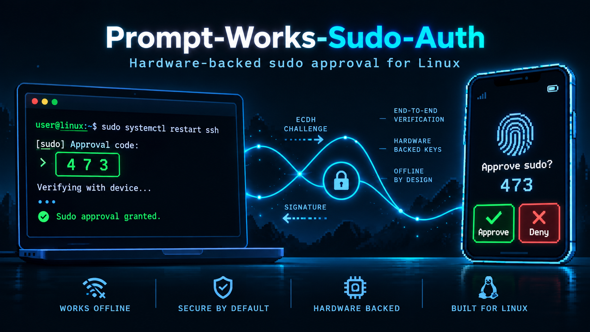
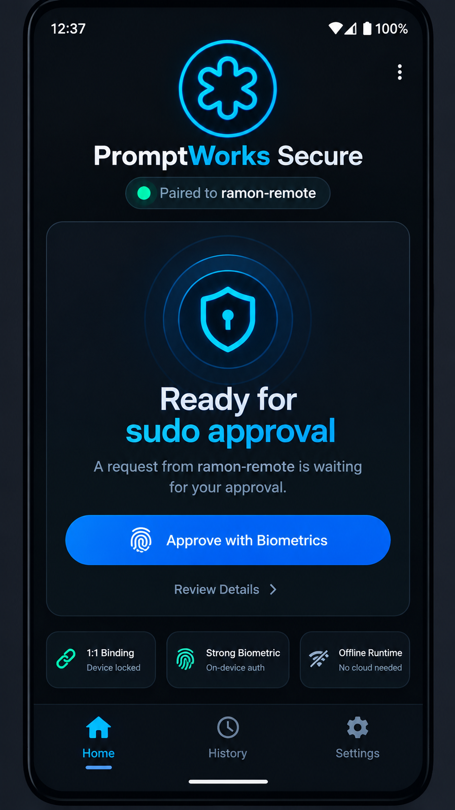
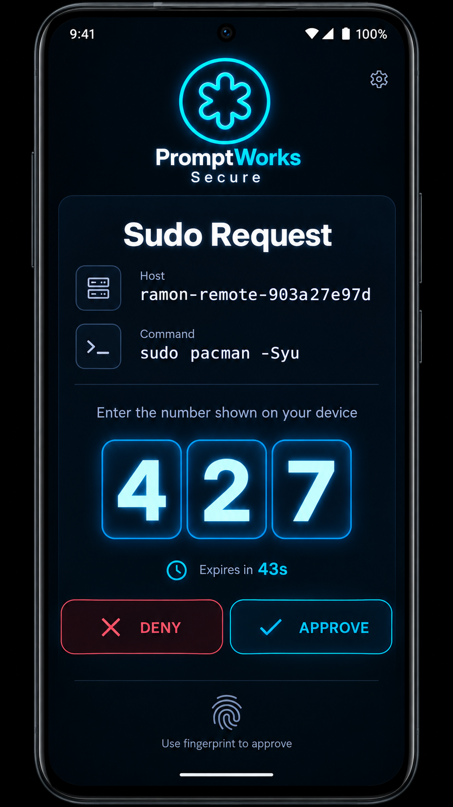
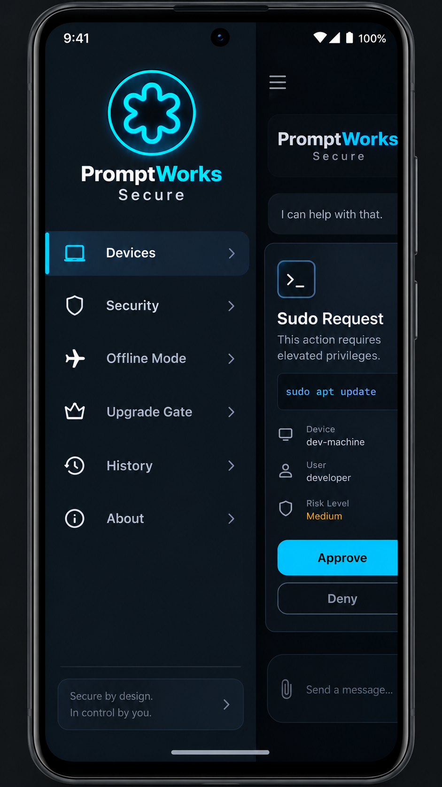

# PromptWorks Sudo Auth

**Repository description:** Hardware-backed Android approval for Linux `sudo`, using a 1:1 paired Pixel/GrapheneOS APK, offline 3-digit number matching, `BIOMETRIC_STRONG`, an on-device 8-digit HMAC decision code, PAM verification with no runtime network dependency, and protected side-by-side upgrades.



PromptWorks Sudo Auth is an experimental Linux second-factor system for `sudo`. It links one Linux installation to one enrolled Android APK installation and requires phone approval before privileged commands are allowed.

The project is designed for Manjaro/Arch and Ubuntu/Debian-family systems, with a Pixel 8 running GrapheneOS as the reference Android device.

> **Security note:** this project modifies PAM. Keep a root shell open during testing. Do not deploy on a daily-driver machine until you have reviewed the code, tested recovery, and understand the rollback path.

## Table of contents

- [What it does](#what-it-does)
- [APK workflow](#apk-workflow)
- [Architecture](#architecture)
- [Security model](#security-model)
- [Install](#install)
- [Upgrade model](#upgrade-model)
- [Repository layout](#repository-layout)
- [Build the APK manually](#build-the-apk-manually)
- [Recovery](#recovery)
- [Status](#status)

## What it does

PromptWorks adds a second authentication step after the normal Linux password or fingerprint flow.

```text
sudo command
   ↓
normal PAM authentication
   ↓
PromptWorks number-match challenge
   ↓
paired APK approve/deny + strong biometric
   ↓
signed backend decision
   ↓
PAM receives the response automatically
   ↓
terminal shows only **** + last four receipt digits
```

Runtime approval uses the 1:1-bound local HTTPS backend so the phone can receive near-real-time request notifications and PAM can receive signed approve/deny decisions automatically. It does not require a cloud service.

## APK workflow

The Android app keeps the approval experience clean and familiar: a dark security dashboard, sudo request screen, approve/deny actions, and a left settings drawer that pushes content to the right.

| Home | Number match | Settings drawer |
|---|---|---|
|  |  |  |

## Architecture

```text
ONE Linux installation
        ↕
ONE Android APK installation
```

The Linux backend and APK are bound as a strict 1:1 pair. A second phone cannot silently replace the enrolled phone. A new backend cannot become trusted merely because it was installed.

During first-time setup:

```text
Linux installer
  ├─ builds APK from terminal
  ├─ installs it over ADB
  ├─ starts temporary HTTPS provisioning
  ├─ pairs the APK and backend
  └─ destroys provisioning material after setup
```

During normal sudo use:

```text
Linux PAM module
  ├─ creates a request on the bound local backend
  ├─ displays the same 3-digit number shown by the APK
  ├─ waits for the phone's signed approve/deny decision
  └─ auto-completes authentication and prints only **** + the last four receipt digits

Android APK
  ├─ keeps a foreground secure-channel listener alive
  ├─ posts a high-priority sudo notification
  ├─ opens directly to the matching request
  └─ requires BIOMETRIC_STRONG before signing APPROVE or DENY
```

## Security model

PromptWorks uses a layered model:

- Normal Linux PAM authentication remains the first factor.
- PromptWorks is installed after the primary auth stack as a required second factor.
- Android approval requires strong biometric authentication.
- Pairing is restricted to one APK and one Linux backend.
- Protected backend upgrades require the currently trusted APK path before switching trust.
- PAM files are backed up before modification.
- First-install commissioning rollback is included.

The project uses elliptic-curve identity/binding concepts and time-limited number matching for the human approval workflow. The short terminal-entered code is intentionally human-sized; for fully asymmetric verification of every decision, a future transport mode should pass full signed payloads over USB/Bluetooth/QR/network.

## Install

Run from the project root as your normal Linux user, not as root:

```bash
chmod +x install-promptworks.sh
./install-promptworks.sh
```

The installer uses `sudo` only when privileged steps are required.

Expected sequence:

```text
1. Preflight
2. Android SDK / ADB checks
3. New APK build and install
4. Temporary provisioning server
5. Candidate pairing
6. Old PAM/APK authorization for protected upgrade
7. PAM/backend activation
8. Verification and rollback guard
```

## Upgrade model

The secure side-by-side upgrade path installs the new APK beside the old one:

```text
Old/current APK: com.promptworks.sudoauth
Previous secure APK: com.promptworks.sudoauth.secure
New v3.7 APK:       com.promptworks.sudoauth.secure.v37
```

The old APK and old PromptWorks PAM/backend binding remain authoritative until the protected backend switch succeeds. If commissioning fails during an upgrade, rollback restores that previous PromptWorks binding rather than dropping to the distro/original PAM mode.

## Repository layout

```text
android/        Android APK source and Gradle project
linux/          PAM module, installer helpers, backend guard, CLI tools
server/         Temporary provisioning service
docs/           Security notes, migration docs, images
.github/        GitHub Actions workflow for APK builds
install-promptworks.sh
```

## Build the APK manually

```bash
cd android
./gradlew clean assembleDebug
```

The debug APK will be under:

```text
android/app/build/outputs/apk/debug/
```

For production-style use, create a release signing key and build a signed release APK. Do not treat a debug APK as a production security artifact.

## Recovery

Before testing PAM changes, keep a root shell open:

```bash
sudo -i
```

Check status:

```bash
sudo promptworksctl status
sudo promptworksctl verify-binding
sudo promptworksctl verify-backend
```

If pairing must be destroyed intentionally:

```bash
sudo promptworksctl reset-pairing
```

## Status

This is a security-sensitive experimental project. Review every PAM and installer change before relying on it. Threat models involving malicious root require additional platform controls such as Secure Boot, measured boot, and filesystem integrity enforcement.

## License

Prompt-Works-Sudo-Auth is distributed under the **PromptWorks Dual License v1.0**. Personal, research, educational, modification, and non-commercial redistribution uses are permitted under the Community Edition terms. Commercial use requires a separate PromptWorks Commercial License. See [`LICENSE`](LICENSE) for the complete terms.
